## 👋 Hi there

I'm building a **Crowdin/memoQ-like [translation assistance and management platform](https://github.com/YKDZ/cat)**\
我正在开发一个类似 Crowdin/memoQ 的 **[软件翻译辅助与管理平台](https://github.com/YKDZ/cat)**

**Focus / 关注方向：**

- 🔄 **End-to-end localization workflows**\
  🔄 涵盖文本与上下文采集、上传、翻译、审校到回源的完整工作流
- 🧠 **Terminology & Translation Memory (TM) management**\
  🧠 术语库 (TB) 与翻译记忆库 (TM) 的维护和回归
- 🤖 **Deep Agent integration for workflow automation**\
  🤖 AI Agent 深度参与并自动化核心与旁支工作流
- ⚙️ **Seamless tech stack & CI/CD integration**\
  ⚙️ 无缝接入各类软件/游戏技术栈与 CI/CD 流水线
- 🛤️ **Issue & PR-driven continuous iteration**\
  🛤️ 基于 Issue 和 PR 驱动的本地化持续迭代机制
- 🖼️ **Extensive multimodal context sourcing**\
  🖼️ 支持广泛的上下文来源（代码、社交软件、Figma、网页截图等）
- 🔌 **Plugin-oriented extensible architecture**\
  🔌 插件化的可扩展架构
- 🔒 **Data security with fully in-house processing**\
  🔒 数据完全内联的安全保障
- 💖 **Free and Open-Source**\
  💖 开源与免费

If you're interested or have suggestions, feel free to reach out via email.  
如有兴趣或建议，欢迎通过邮箱交流。

---

  

---

<h3>📊 GitHub Stats</h3>

  
  

---

### 🎮 Minecraft

  <strong>ID</strong>: <code>YK_DZ</code> 
  

